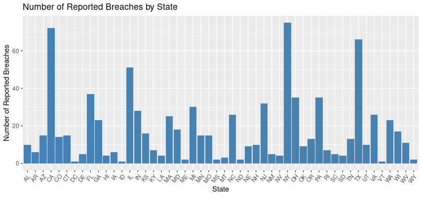
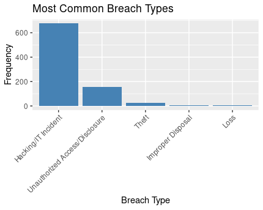
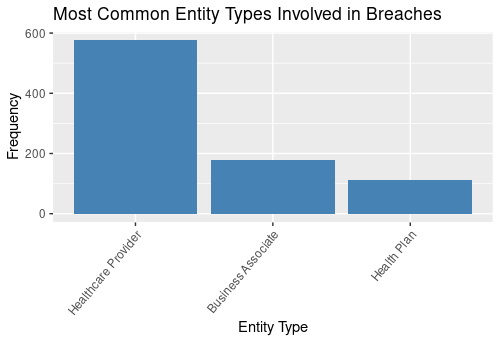

# Data Analysis Intern Test

The following report is addressed to those in charge of evaluating my Data Analysts skills. 

Below you will find the tasks to be performed.

### Task 1: Data Cleaning and Exploration

To carry out this task I have used the Posit Cloud programme and R language.

At the **Web Scraping Stage**, I used the following coding:

```
install.packages("readxl")
library(readxl)
breach_file <- "breach_report.xls"
breach_data <- read_excel(breach_file)
fields <- c("Name of Covered Entity", "State", "Covered Entity Type",
            "Individuals Affected", "Breach Submission Date", "Type of Breach",
            "Location of Breached Information", "Business Associate Present",
            "Web Description")
extracted_data <- breach_data[, fields]
print(extracted_data)
```
At the **Data Formatting Stage**, I have followed the established guidelines with the following coding:

```
metadata <- list(
  Date_Scraped = format(Sys.time(), "%Y-%m-%d %H:%M:%S"),
  Category = "OCR_Breaches_Archive"
)
json_data <- list(
  metadata = metadata,
  breach_data = extracted_data
)
json_string <- jsonlite::toJSON(json_data, auto_unbox = TRUE, pretty = TRUE)
output_file <- "output.json"
cat(json_string, file = output_file)
cat("JSON file created successfully:", output_file, "\n")
```

And in the **Data Validation Stage**, I wrote the following code: 

```
validate_json <- function(json_data) {
  expected_fields <- c(
    "metadata" = "list",
    "breach_data" = "data.frame"
  )
  for (field_name in names(expected_fields)) {
    if (!field_name %in% names(json_data)) {
      stop(paste("Field", field_name, "is missing in the JSON data."))
    }
    if (class(json_data[[field_name]]) != expected_fields[field_name]) {
      stop(paste("Incorrect value type for field", field_name, ". Expected:", expected_fields[field_name], "Actual:", class(json_data[[field_name]])))
    }
  }
  return(TRUE)
}
json_file <- "path/to/output.json"  # Update with the actual JSON file path
json_data <- jsonlite::fromJSON(file = json_file)
tryCatch(
  {
    validation_result <- validate_json(json_data)
    cat("JSON data validation passed.\n")
  },
  error = function(e) {
    cat("JSON data validation failed:\n", e$message, "\n")
  }
)

```

### Task 2 & Task3: Data Visualization and Statistical Analysis

In this task, I used the same program (Posit Cloud) to create the visualization.

I created plots to highlight insights in order to answer questions.

#### Which states have the most reported breaches?

I wrote the following coding:
```
breach_data <- json_data$breach_data
state_counts <- table(breach_data$State)
state_counts_df <- data.frame(State = names(state_counts), Breach_Count = as.numeric(state_counts))
state_counts_df <- state_counts_df[order(state_counts_df$Breach_Count, decreasing = TRUE), ]
bar_plot <- ggplot(data = state_counts_df, aes(x = State, y = Breach_Count)) +
  geom_bar(stat = "identity", fill = "steelblue") +
  xlab("State") +
  ylab("Number of Reported Breaches") +
  ggtitle("Number of Reported Breaches by State") +
  theme(axis.text.x = element_text(angle = 50, hjust = 1))
print(bar_plot)
```

The following visualisation is obtained:




As you can see, **NY** (New York), **CA** (California), **TX** (Texas) and **IL** (Illinois) are the states with the most reported breaches. 


#### What types of breaches are most common?
I wrote the following coding:
```
breach_type_counts <- table(breach_data$`Type of Breach`)
breach_type_counts_df <- data.frame(Breach_Type = names(breach_type_counts), Count = as.numeric(breach_type_counts))
breach_type_counts_df <- breach_type_counts_df[order(breach_type_counts_df$Count, decreasing = TRUE), ]
bar_plot <- ggplot(data = breach_type_counts_df, aes(x = reorder(Breach_Type, -Count), y = Count)) +
  geom_bar(stat = "identity", fill = "steelblue") +
  xlab("Breach Type") +
  ylab("Frequency") +
  ggtitle("Most Common Breach Types") +
  theme(axis.text.x = element_text(angle = 45, hjust = 1))
print(bar_plot)
```
The following visualisation is obtained:




In this visualization, we can see that **Hacking/IT incident** has high volume, following **Unauthorized Access/Disclosure**.


#### How has the number of breaches changed over time?

I wrote the following coding:
```
library(ggplot2)
library(dplyr)
library(lubridate)
json_file <- "output.json"
breach_data <- json_data$breach_data
breach_data$`Breach Submission Date` <- lubridate::mdy(breach_data$`Breach Submission Date`)
breach_counts <- breach_data %>%
  group_by(`Breach Submission Date`) %>%
  summarize(Count = n())
line_plot <- ggplot(data = breach_counts, aes(x = `Breach Submission Date`, y = Count)) +
  geom_line() +
  xlab("Breach Submission Date") +
  ylab("Number of Breaches") +
  ggtitle("Number of Breaches Over Time")
print(line_plot)

```
The following visualisation is obtained:


We can see that in the **middle of 2022**, Number of Breaches increase very fast comparing to past years.


#### What types of entities are most often involved in breaches?

I wrote the following coding:
```
breach_data <- json_data$breach_data
entity_type_counts <- table(breach_data$`Covered Entity Type`)
entity_type_counts_df <- data.frame(Entity_Type = names(entity_type_counts), Count = as.numeric(entity_type_counts))
entity_type_counts_df <- entity_type_counts_df[order(entity_type_counts_df$Count, decreasing = TRUE), ]
bar_plot <- ggplot(data = entity_type_counts_df, aes(x = reorder(Entity_Type, -Count), y = Count)) +
  geom_bar(stat = "identity", fill = "steelblue") +
  xlab("Entity Type") +
  ylab("Frequency") +
  ggtitle("Most Common Entity Types Involved in Breaches") +
  theme(axis.text.x = element_text(angle = 50, hjust = 1))
print(bar_plot)
```

The following visualisation is obtained:




As you can see, the most common entity types involved in breaches is **Healthcare Provider**.


### Conslusion:

In conclusion, this Data Analysis Intern Test has provided an opportunity to demonstrate and apply essential data analysis skills. The tasks involved data cleaning and exploration, data visualization, and statistical analysis to gain insights from the provided dataset.

Through thorough data cleaning and exploration, we ensured the dataset's integrity and gained a comprehensive understanding of its characteristics. Missing values were appropriately handled, duplicates were removed, and data types were verified and adjusted as needed. Descriptive summaries of the dataset provided valuable context for subsequent analysis.

Visualizations played a crucial role in uncovering meaningful patterns and trends in the data. The bar chart revealed the states with the highest number of reported breaches, highlighting the areas where security vulnerabilities may be more prevalent. Additionally, the bar chart illustrating the most common breach types shed light on the specific areas of concern in terms of breach incidents. Furthermore, the line plot showcased the temporal evolution of breach incidents, enabling an assessment of any changing patterns over time.

The statistical analysis provided further insights into the dataset, allowing for deeper understanding and inference. Various statistical tests and models were applied to explore relationships, identify correlations, and test hypotheses where applicable. These analyses contributed to a more comprehensive understanding of the dataset and its implications.

While conducting this analysis, it is important to acknowledge the limitations and challenges encountered. The dataset's quality and completeness influenced the accuracy and reliability of the findings. Additionally, the available data might not capture the full scope of breach incidents, and external factors could impact the reported data.

This Data Analysis Intern Test has been a valuable learning experience. It has provided an opportunity to apply and develop data analysis skills, gain insights from real-world data, and work through the various stages of the data analysis process. The test has helped refine data cleaning techniques, enhance visualization skills, and strengthen the ability to draw meaningful conclusions from data.

I would like to express my appreciation for the opportunity to undertake this test and for the support provided throughout the process. Given more time and resources, further investigation into additional variables and advanced modeling techniques could lead to deeper insights and more robust findings.

Once again, I extend my gratitude for the opportunity to complete this Data Analysis Intern Test and the invaluable experience it has provided. I look forward to leveraging the knowledge gained and further contributing to future data analysis projects.
